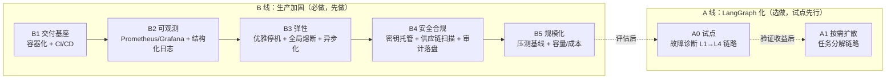

# enterprise_alert_agent 企业级升级路线图 v2.0

> 文档版本：v2.0（2026-08-21）
> 前置文档：`ENTERPRISE_EVALUATION-v1.md`（v1.0 已完成 P0/P1/P2 绝大部分整改，系统达到「生产可用」）
> 用途：作为系统从「生产可用」升级到「企业级可持续运营」的整改依据
> 核心结论：**企业级 = B 线（生产加固），必须做、先做；LangGraph 化 = 架构升级，选做、试点先行。**

---

## 目录

- [一、总体结论](#一总体结论)
- [二、升级定位与判断框架](#二升级定位与判断框架)
- [三、两条主线概览](#三两条主线概览)
- [四、B 线：企业级生产加固（必做）](#四b-线企业级生产加固必做)
- [五、A 线：LangGraph 编排升级（选做，试点先行）](#五a-线langgraph-编排升级选做试点先行)
- [六、升级路线图（分阶段执行清单）](#六升级路线图分阶段执行清单)
- [七、风险与取舍](#七风险与取舍)
- [八、验收标准（Definition of Done）](#八验收标准definition-of-done)

---

## 一、总体结论

**v1.0 解决了「正确性与安全性」，v2.0 目标是把系统从「能上线」推进到「企业级可持续运营」。**

- **企业级的硬门槛在 B 线**：部署交付、可观测、安全合规、弹性、测试——这些是运行时质量属性，**不做 LangGraph 也必须做**，是评分继续上升的关键。
- **LangGraph 化是可选的架构优化**：它是"手段"不是"目的"，只在特定条件命中时才有正向 ROI，且必须**试点先行、按需扩散，禁止大爆炸重写**。
- **一句话**：先补齐 B 线（决定"能不能运营"），LangGraph 只在核心复杂链路选择性引入（决定"代码好不好维护"）。

---

## 二、升级定位与判断框架

### 2.1 为什么 LangGraph 不是企业级的必要条件

企业级 Agent 的验收标准是 SLA、安全、可观测、可测试、可恢复、可运维——这些与"用什么编排框架"正交：

- 现有 `ChatService` 13 步命令式编排，只要**正确、稳定、有测试覆盖**，即为合格；编排范式本身不影响能否达到 99.9% 可用性。
- 简单链路（1~3 步决策、单 Agent + 工具调用、纯 RAG 问答）**保持现状即可**，图化属于过度设计。

### 2.2 LangGraph 化「是否值得做」判断表

命中越多越该做（命中越少越应保持现状）：

| 判断信号 | 当前系统现状 | 命中度 |
|---|---|---|
| 手写编排已成维护/改错负担（改一处牵连多处） | 13 步硬编码 + 步骤内直读 `settings.*`（v1 P1-8） | ⚠️ 部分 |
| 需要崩溃后断点恢复长流程，全链路重跑代价高 | 单请求多为秒级，重跑成本可接受 | ❌ 弱 |
| 复杂条件分支/循环自研且脆弱 | 故障降级 L1→L4、依赖环检测均为自研 | ⚠️ 部分 |
| 需要标准 HITL / Supervisor / Fan-out 模式 | 人机协同 v1 刚修好、仍是自研骨架 | ⚠️ 部分 |
| 团队需长期迭代扩展 Agent 编排 | 取决于路线规划 | ？ |

**结论：当前为「部分命中」——有收益，但不紧迫、不阻断上线。**

---

## 三、两条主线概览

| 主线 | 性质 | 优先级 | 风险 |
|---|---|---|---|
| **B 线** 生产加固 | 企业级硬门槛 | 高（先做） | 低（增量、可回滚） |
| **A 线** LangGraph 化 | 架构优化 | 中（后做、选做） | 中高（重构，需测试兜底） |

---

## 四、B 线：企业级生产加固（必做）

### B1 交付基座（DevOps）

| 项 | 目标 | 交付物 |
|---|---|---|
| (已完成)容器化 | 多阶段构建、非 root 用户、健康探针 | `Dockerfile` + `.dockerignore` |
| (已完成)本地编排 | 一键起全套依赖 | `docker-compose.yml`（Redis/PG/Chroma/app） |
| (已完成)生产编排 | 标准化部署 | K8s manifests（Deployment/Service/HPA/Probe） |
| (已完成)配置分离 | 配置与镜像解耦 | ConfigMap/Secret 挂载，替代散落 `.env` |
| (已完成)CI/CD | 自动化质量门禁 | GitHub Actions：lint → 单测 → 构建 → 安全扫描 → 推送 |

### B2 可观测性标准化

- **指标外部化**：接入 Prometheus（`/metrics` 导出）+ Grafana 面板（延迟 P50/P95/P99、Token、错误率、缓存命中、熔断状态），替代仅内存的 `MetricsCollector`。
- **结构化日志**：全量 JSON 日志（含 `trace_id/tenant_id/request_id`），对接 ELK/Loki。
- **告警闭环**：`AlertManager` 接入真实通道（钉钉/企业微信/Webhook/PagerDuty），与 Prometheus Alertmanager 打通。
- **追踪贯通**：LangSmith `trace_id` 与日志、指标三者可关联下钻。

### B3 弹性与高可用

- **优雅停机**：`lifespan` 关闭时排空进行中请求、flush 审计、关闭连接池。
- **全局熔断与背压**：LLM/MCP/DB 各依赖独立熔断 + 全局并发闸门，过载返回 429。
- **健康检查分级**：`/health/live` 与 `/health/ready`（探测 Redis/PG/Chroma/MCP 实际连通性）。
- **异步化收尾**：同步 psycopg/redis 驱动、`time.sleep` 退避改 async，释放线程池、提升吞吐。

### B4 安全与合规加固

- **密钥托管**：从环境变量升级到 Vault/KMS/云 Secrets Manager，支持轮换。
- **供应链安全**：CI 集成 `gitleaks`（密钥泄露）、`trivy`（镜像漏洞）、`pip-audit`（依赖 CVE）。
- **审计合规**：审计日志 append-only 落盘/落对象存储，满足不可篡改与保留期；敏感字段脱敏留痕。
- **多租户强隔离**：租户级配额、限流、数据分区强制校验（v1 已必填，v2 做资源隔离与配额）。

### B5 规模化与容量规划

- **压测基线**：Locust/k6 建立 QPS、延迟、P99、错误率基线，验证 HPA 扩缩容。
- **成本预算**：Token 成本看板 + 租户级预算告警（复用已有 `BudgetExceededError`）。

---

## 五、A 线：LangGraph 编排升级（选做，试点先行）

> 原则：**只对「多步决策 + 分支循环 + 需断点恢复」的核心链路做图化**；简单链路保持现状。技术栈为 Python，对应目标是 **LangGraph（Python 原生）**，非文章中的 LangGraph4j。

### A0 试点（唯一强制先行项）

- **试点对象**：**故障诊断 L1→L4 降级 + 人工干预** 链路（分支/循环/HITL 最复杂、相对独立、风险可控，最能体现图编排价值）。
- **改造要点**：
  - 引入类型化 `AgentState`，收敛该链路散落的中间变量。
  - 用 `StateGraph` 表达 L1 重试 → L2 调参 → L3 仅 RAG → L4 人工 的条件边与循环边。
  - 人工干预节点改为 LangGraph 原生 Human-in-the-Loop。
  - 接入 Checkpoint（复用现有 Redis/PG）验证断点恢复。
- **验收**：代码量下降、流程可视化、可恢复、回归测试通过。

### A1 按需扩散（试点通过后再决策）

- 若试点收益明确 → 扩散到**任务分解并行执行**链路（Supervisor + Worker + Fan-out）。
- 简单链路（单 Agent + 工具调用、纯 RAG 问答）**保持现状，不图化**。

### A 线前置条件（硬性）

- **必须先补齐测试覆盖**（v1 P1-2 短板）：在测试薄弱时做大重构，是拿稳定性换架构美感，得不偿失。
- **禁止全量一次性重写** `ChatService`。

---

## 六、升级路线图（分阶段执行清单）

### 阶段 M1：交付基座（B1）— 最高优先级

- [ ] 编写多阶段 `Dockerfile`（非 root、healthcheck）+ `.dockerignore`
- [ ] `docker-compose.yml` 一键起 app + Redis + PG + Chroma
- [ ] K8s manifests：Deployment/Service/HPA/liveness+readiness Probe
- [ ] 配置改为 ConfigMap/Secret 挂载
- [ ] GitHub Actions：lint → 单测 → 构建镜像 → 安全扫描 → 推送

### 阶段 M2：可观测（B2）

- [ ] `/metrics` 暴露 Prometheus 指标；`MetricsCollector` 改为导出器
- [ ] Grafana 面板（延迟/Token/错误率/缓存/熔断）
- [ ] 结构化 JSON 日志（贯穿 `trace_id/tenant_id/request_id`）
- [ ] 告警接入真实通道 + Alertmanager 打通

### 阶段 M3：弹性与安全（B3 + B4）

- [ ] 优雅停机（排空请求、flush 审计、关闭连接池）
- [ ] 依赖级熔断 + 全局并发闸门（过载 429）
- [ ] `/health/live` 与 `/health/ready` 依赖探活
- [ ] Redis/psycopg 异步驱动、退避改 async
- [ ] 密钥托管（Vault/KMS）+ 轮换
- [ ] CI 集成 gitleaks / trivy / pip-audit
- [ ] 审计 append-only 落盘 + 敏感脱敏
- [ ] 多租户配额与资源隔离

### 阶段 M4：规模化（B5）

- [ ] Locust/k6 压测，建立 QPS/延迟/P99/错误率基线
- [ ] 验证 HPA 扩缩容
- [ ] Token 成本看板 + 租户预算告警

### 阶段 M5：LangGraph 试点（A0，前置：测试补齐）

- [ ] 补齐核心链路单元/集成测试（mock 模型/DB）
- [ ] 故障诊断链路引入 `AgentState` + `StateGraph`
- [ ] L1→L4 改条件边/循环边；HITL 原生化
- [ ] 接入 Checkpoint（Redis/PG）验证断点恢复
- [ ] 收益评估（代码量/可视化/可恢复/回归）

### 阶段 M6：LangGraph 扩散（A1，条件触发）

- [ ] 若 A0 收益明确 → 任务分解链路 Supervisor/Fan-out 化
- [ ] 简单链路保持现状（明确不图化）

---

## 七、风险与取舍

| 决策 | 收益 | 风险 | 建议 |
|---|---|---|---|
| 先做 B 线 | 直接决定能否企业级运营 | 低（增量、可回滚） | ✅ 立即执行 |
| A 线全量重写 | 架构统一美观 | 高（回归成本大，测试薄弱期尤甚） | ❌ 不做 |
| A 线试点先行 | 低风险验证图编排价值 | 中（局部重构） | ✅ B 线后执行 |
| 简单链路图化 | 无实质收益 | 过度设计 | ❌ 不做 |

**核心取舍**：并非所有链路都要图化。**在测试覆盖补齐前，不做大重构**；LangGraph 的价值只在核心复杂链路（故障诊断、任务分解）兑现。

---

## 八、验收标准（Definition of Done）

**B 线（企业级达标线，必达）：**

- [ ] 可用 `docker compose up` / K8s 一键部署，探针正常
- [ ] CI 全绿（lint + 单测 + 安全扫描）
- [ ] Grafana 可见核心指标，告警可触达真实通道
- [ ] 无硬编码密钥，密钥可轮换，供应链扫描通过
- [ ] 审计不可篡改、可追溯；多租户资源隔离生效
- [ ] 有压测基线报告与容量/成本结论

**A 线（图化，选达）：**

- [ ] 故障诊断链路以 StateGraph 运行，支持断点恢复
- [ ] 试点回归测试通过，收益评估结论明确
- [ ] 简单链路维持现状，未过度图化

---

> 备注：本文档为升级参考蓝图，具体代码骨架（`Dockerfile`、CI、Prometheus 接入、`AgentState`/`StateGraph` 示例）在对应阶段启动时按需产出。
