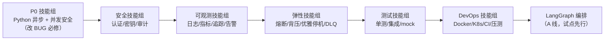

# Enterprise Agent 开发技能路线图

> 版本：v2.0（2026-08-30，**更完善版**：补齐招聘文档 3/4/5 段要求）
> 依据：`ENTERPRISE_EVALUATION-v2.md`（B 线 + A 线）+ v1 遗留缺口（P0/P1/P2）+ **任职要求（`C:\Users\36161\Desktop\任职要求.txt`，共 5 段：核心要求/优先/加分 + 岗位职责 + 文档3 分布式 + 文档4 LLM + 文档5 产品化）**，并结合本项目实际代码（`chat_service.py`、`alert_manager.py`、`main.py`、`infrastructure/*`、`k8s/*` 等）。
> 用途：把「企业级 Agent 开发 + 5 段岗位任职要求」拆解为可逐个攻克的技能点，每个技能点都标注了**在本项目里的落点、当前差距、学习要点、动手练习**。

---

## 〇、先看结论：你该按什么顺序学

企业级 = **先可靠、再安全、后规模、最后架构升级**。对应学习顺序：

### 完整技能树总览（五层模型，v2.0 新增）

```mermaid
flowchart TD
    subgraph 基础层["① 基础层（地基）"]
        T0["T0 Python 异步/并发/线程安全"]
        T8["T8 工程实践/测试/DevOps"]
    end
    subgraph 数据层["② 数据与存储"]
        D1["PostgreSQL / Redis / 连接池/事务/索引"]
        D2["消息队列（Redis Stream/Celery/Kafka/RabbitMQ）"]
        D3["向量库（Chroma/Qdrant/Milvus/PGVector）"]
        D4["ORM（SQLAlchemy/SQLModel）"]
    end
    subgraph Agent层["③ Agent 核心层"]
        A1["Prompt 工程 / 上下文工程 / Token 优化"]
        A2["工具调用 / Function Calling / MCP"]
        A3["Skills 技能生态 / 注册 / 上下文注入"]
        A4["RAG（混合检索/重排/评估）"]
        A5["记忆系统（短期/长期/PII/用户偏好）"]
        A6["编排（LangGraph/ReAct/Plan-and-Execute）"]
        A7["多 Agent / 反思 / 任务状态管理"]
        A8["多模型接入与路由"]
        A9["Agent 评估（LLM-as-judge/回归）"]
    end
    subgraph 质量层["④ 企业级质量层"]
        Q1["可观测（日志/指标/追踪/告警）"]
        Q2["弹性（熔断/背压/优雅停机/DLQ/弱网）"]
        Q3["高并发（限流/幂等/热点/缓存）"]
        Q4["安全合规（认证/密钥/审计/多租户/端云契约）"]
        Q5["排障运维（容器/端口/内存/网络）"]
    end
    subgraph 进阶层["⑤ 进阶/加分"]
        X1["知识图谱 / GraphRAG"]
        X2["Fine-tuning / HF 生态"]
        X3["微服务 / 分布式系统"]
        X4["云平台（阿里云/AWS/腾讯云）"]
        X5["Workflow 自动化 / Dify / Semantic Kernel / AutoGen"]
        X6["强化学习 / RLHF 认知"]
        X7["主动服务 / 事件驱动 / 状态机"]
    end
    基础层 --> 数据层 --> Agent层 --> 质量层 --> 进阶层
```

- **P0 技能组是地基**：`alert_manager.py` 那个 `ThreadPoolExecutor + asyncio.create_task` 的 BUG（P0-3）说明，不搞懂 Python 异步/线程边界，连正确性都保证不了。
- **测试技能组是 LangGraph 化的前置条件**：v2 文档明确「测试薄弱时不做大重构」，所以测试要排在 A 线之前。
- 每个技能点后面标了 🎯（动手练习），练习都落在本项目里，学完即用。

---

## 一、任职要求 → 技能点对照（新增）

> 对照 `C:\Users\36161\Desktop\任职要求.txt` 的「核心要求 / 优先考虑 / 加分项 / 岗位职责」，逐条映射到本项目。**标 🔴 的是你目前最缺、最该补的**。

| 任职要求（原文要点） | 对应技能点 | 项目落点 | 当前差距与学习重点 |
|---|---|---|---|
| **核心1** FastAPI / Pydantic / SQLAlchemy/SQLModel / 异步 | T0 异步 + **T8-4 ORM** | `app/api`、`config/settings.py`（Pydantic v2） | 🔴 项目用裸 psycopg，**缺 SQLAlchemy/SQLModel 建模、事务、索引、迁移** |
| **核心2** PG/Redis：连接池 / 事务 / 索引 / 缓存 / **消息队列** | T0-3 + T7 缓存 + **T5-4 消息队列** | `redis_postgres_conversation_memory.py`、`multi_tier_cache.py` | 🔴 **消息队列未系统学**（Redis Stream / Celery / Kafka） |
| **核心3** C 端高并发：限流 / 降级 / **幂等** / 缓存 / **热点** | T7 + T5 降级 + **T5-5 幂等** + T7-1 热点 | 限流仅 `/chat/stream`；降级 L1→L4 | 🔴 幂等、热点数据、全局限流未覆盖 |
| **核心4** 分层架构 / 模块职责边界 | **T8-5 架构** | `app/{api,application,infrastructure,rag,observability}` | ✅ 已分层 → 学 DDD、依赖注入、依赖方向 |
| **核心5** 线上排障（日志/监控/容器/端口/内存/网络） | **T9 排障实战** | 已有 `/metrics`、`/health`、JSON 日志 | 🔴 新增整组：docker logs、netstat/ss、内存、K8s 排障 |
| **核心6** 安全：Token / 密码 / 密钥 / 支付 / 隐私 | T6 全部 | `/admin/token` P0 BUG | 🔴 修复 + 引入支付/隐私合规视角 |
| **优先1** Agent 工具调用 / 插件 / **Skills 体系** / 能力注册 / 按需加载 / 上下文注入 | **T1-5 技能生态** | `infrastructure/skill/`、`tool/static.py`、`SkillFunc` | 🔴 需做成**可复用、可治理**的技能注册 + 按需加载 + 上下文注入 |
| **优先2** WebSocket / SSE / 长连接 / 异步任务 / 流式 / 实时事件 | T0-4 SSE（已有）+ **T1-6 WebSocket** + **T5-4 异步任务** | `chat_service.aask_stream` 已流式 | 🔴 WebSocket、Celery/后台任务未做 |
| **优先4** 性能分析 / 并发优化 / 压测 | T7-4 + T7-3 压测 | B5 未建基线 | ⚠️ Locust/k6 + cProfile/py-spy |
| **加分1** AI Agent / LLM / RAG / 向量库 / 多智能体 | T1 / T2 / **T1-8 多智能体** | RAG 已实现，`agent_coordinator.py` 已有雏形 | ⚠️ 深化多智能体协作 + 反思 |
| **加分2** Agent Skills / Tool-Use / MCP / Function Calling / 技能生态 | T1-4 MCP + T1-5 Skills | MCP 客户端已接 | ⚠️ 补齐技能治理与扩展范式 |
| **加分3** OpenAI 兼容 API + 多模型路由（Anthropic/Gemini/DeepSeek/智谱） | **T1-7 模型路由** | `model_client.py` 仅单 provider | 🔴 新增：统一网关 + 模型降级/路由 |
| **加分4** Qdrant / LangGraph / CrewAI / LangChain / Celery / Redis Stream | T1-2 / T2-3 / T5-4 | 已引入 LangGraph/LangChain/Chroma | ⚠️ 补 Qdrant、CrewAI、Celery、Redis Stream |
| **加分8** CI/CD / 容器化 / 可观测性 | T8-2 / T8-3 / T4 | Docker/K8s 有，CI 无 | ⚠️ 建 CI + 链路追踪贯通 |
| **职责①** 规划 / 记忆 / 工具调用 / **反思** / 多 Agent 协作 | T1-3 规划 + T3 记忆 + **T1-8 反思** | 规划/记忆/工具已有 | ⚠️ **反思（Reflection）与自我纠错未做** |
| **职责③** Function Calling / ReAct / **Plan-and-Execute** / Multi-Agent 工作流 | T1-1 / T1-2 / **T1-3** | 手写 13 步编排 | ⚠️ 用 LangGraph 表达 Plan-and-Execute |
| **职责④** 执行效率 / **成本控制** / 容错 / 交互体验 | T7 成本 + T5 容错 + T0-4 流式 | 有 `BudgetExceededError` | ⚠️ Token 成本看板 + 租户预算告警 |

### 补充对照：文档 3 / 4 / 5 独有要求（v2.0 新增）

| 招聘原文（文档段） | 对应技能点 | 项目落点 | 差距与学习重点 |
|---|---|---|---|
| **文档3** 微服务架构 / 分布式系统设计 | **T8-6 分布式** | 单体应用 | 🔴 补微服务拆分、分布式事务、一致性 |
| **文档3** Kafka / RabbitMQ 消息中间件 | T5-4 消息队列 | 仅 Redis list DLQ | 🟠 补 Kafka/RabbitMQ 对比与选型 |
| **文档3** 云平台（阿里云/AWS/腾讯云） | **T8-7 云平台** | 本地 / Docker | 🟠 托管 K8s、对象存储、云上可观测 |
| **文档4** Prompt / Fine-tuning / Hugging Face | **T1-9 Prompt** + **T2-5 微调/HF** | 有 Prompt 组装，无微调 | 🟠 上下文工程 + HF 生态 + 微调认知 |
| **文档4** LangChain / **Semantic Kernel** / **Dify** | T1 全组 | 已用 LangChain/LangGraph | 🟠 对比 Semantic Kernel、Dify 低代码 |
| **文档4** 日志监控与**评估体系** | T4 + **T1-10 Agent 评估** | 有日志/指标，无 Agent 评估 | 🔴 LLM-as-judge、轨迹评估、回归 |
| **文档4** **知识图谱** / **强化学习** / 多 Agent | **T2-4 GraphRAG** + T1-8 + T7-6 RL | 无图谱、无 RL | 🟢 进阶加分项 |
| **文档5** **上下文工程** / 上下文窗管理 / Token 优化 | **T1-9** + T7-7 | 有 `max_tokens`/裁剪，无系统性上下文预算 | 🔴 把「上下文预算」当系统资源管理 |
| **文档5** **任务状态管理** / 状态机 / 恢复 | **T1-11 状态机** | 有任务分解，无持久化任务状态 | 🔴 任务状态机 + 断点恢复（配合 LangGraph Checkpoint） |
| **文档5** **端云接入契约**：协议 / 错误码 / 鉴权 / 日志规范 | **T8-8 契约设计** | 有 API 路由，无契约文档 | 🟠 错误码规范、OpenAPI、版本兼容 |
| **文档5** **主动服务**：触发 / 决策 / 频控 / 确认 / 反馈 | T5 限流 + T1-8 | 纯被动问答 | 🟢 事件驱动 + 频控 + 用户偏好 |
| **文档5** **弱网处理** / 超时重试 / 异常恢复 | T5-3 + T0-3 | 有重试/超时，无弱网专项 | 🟠 客户端重试语义、幂等重放 |
| **文档5** **AI 编程工具**（Copilot/Claude Code/Cursor/Codex）+ AI 研发沉淀 | **T8-9** | 正在用 | 🟠 把 AI 辅助研发流程化、沉淀规范 |

---

## 二、技能总览表

| 技能组 | 技能点 | 项目落点 | 当前差距 | 优先级 |
|---|---|---|---|---|
| **T0 异步/并发** | asyncio 事件循环与任务 | `alert_manager.py` P0-3 | ⚠️ 线程里调 `asyncio.create_task` → RuntimeError | 🔴 P0 |
| | 线程安全与共享状态 | `MetricsCollector` / `AgentRegistry` / `DynamicSettings` | ⚠️ 无锁、无界 | 🔴 P0 |
| | 异步驱动与连接池 | `redis_postgres_conversation_memory.py` | ✅ 已异步化（可复盘） | 🟡 |
| | 流式输出 | `chat_service.aask_stream` | ✅ 已实现（可复盘） | 🟡 |
| **T1 Agent 编排** | Agent Loop 与工具调用 | `chat_service._arun_agent_loop`（13 步编排） | ⚠️ 命令式硬编码，改一处牵多处 | 🟠 A 线 |
| | LangGraph StateGraph | 故障诊断 L1→L4 链路（A0 试点） | ❌ 未图化 | 🟠 A 线 |
| | HITL 人工干预 | `intervention_handler.py` | ⚠️ v1 P1：未接入 agent loop | 🟠 |
| | 任务分解 + 并行执行 | `_adecompose_task` / `_adexecute_decomposed_tasks` | ✅ 已实现依赖感知并行（可复盘） | 🟡 |
| | MCP 协议 | `infrastructure/mcp/mcp_service.py` | ⚠️ v1 P2：每调用新建会话、无超时 | 🟡 |
| | 技能生态（Skills/注册/上下文注入） | `infrastructure/skill/` + `tool/static.py` | ⚠️ 需做成可复用、可治理 | 🔴 |
| | WebSocket / 实时事件 | 无（仅 SSE） | ❌ 未做 | 🔴 |
| | 多模型接入与路由 | `llm/model_client.py` | ⚠️ 仅单 provider | 🔴 |
| | 多智能体协作 + 反思 | `agent_coordinator.py` | ⚠️ 缺反思（Reflection）闭环 | 🟠 |
| | Prompt / 上下文工程 / Token 优化 | `chat_service._build_base_system_prompt` | ⚠️ 无系统性上下文预算 | 🔴 |
| | 任务状态管理 / 状态机 | 任务分解无持久化状态 | ❌ 未做 | 🔴 |
| | Agent 评估（LLM-as-judge） | 无评估链路 | ❌ 未做 | 🟠 |
| **T2 RAG 知识层** | 分块与索引 | `rag/splitter` | — | 🟡 |
| | 混合检索（稠密+BM25+重排） | `rag/retrieval/retriever.py` | ⚠️ flashrank 声明未用（P2-1） | 🟠 |
| | 向量库（Chroma） | `infrastructure/vectorstore/chroma_store.py` | ✅ 已接入 | 🟡 |
| | RAG 评估 | `data/create_mock_db.py` + 评测文档 | ⚠️ 有文档无自动化评估 | 🟠 |
| | 知识图谱 / GraphRAG（进阶） | 无 | ❌ 未做 | 🟢 |
| | Fine-tuning / Hugging Face 生态（进阶） | 无 | ❌ 未做 | 🟢 |
| **T3 记忆层** | 双级记忆（Redis+PG） | `redis_postgres_conversation_memory.py` | ✅ 已实现 + PII 脱敏 | 🟡 |
| | 记忆摘要与裁剪 | `chat_service.abuild_memory_summary` | ✅ 已实现（可复盘） | 🟡 |
| **T4 可观测性** | 结构化日志（JSON + trace_id） | `observability/logging_config.py` | ✅ 已有（可复盘补全埋点） | 🟠 |
| | Prometheus 指标 | `observability/prometheus_metrics.py` + `/metrics` | ✅ 已暴露（可复盘 Gauge/Histogram 语义） | 🟠 |
| | 分布式追踪（LangSmith） | `observability/langsmith_tracer.py` | ✅ 纪律好 | 🟡 |
| | 告警通道（钉钉/企微/PagerDuty） | `alert_manager.py` | ⚠️ 仅 Webhook，未打通真实通道 | 🟠 |
| **T5 弹性/高可用** | 熔断器（per-dependency） | `fault/circuit_breaker.py` + LLM/PG/Redis/MCP | ✅ 已全部覆盖（可复盘） | 🟡 |
| | 并发闸门/背压/429 | `main.py request_semaphore` | ✅ 已实现 | 🟡 |
| | 优雅停机 | `main.py _drain_inflight` | ✅ 已实现 | 🟡 |
| | 健康检查（live/ready） | `api/routers/health.py` | ✅ 已实现真实探活 | 🟡 |
| | 重试与退避、超时预算 | `fault/fault_analyzer.py` | ✅ 部分 | 🟠 |
| | DLQ 死信队列 | `infrastructure/queue/dlq_handler.py` | ⚠️ v1 P1：只写不读 | 🟠 |
| | 消息队列 / 异步任务（Redis Stream/Celery/Kafka） | `queue/dlq_handler.py` | ⚠️ 仅 DLQ 无消费端 | 🔴 |
| | 幂等设计 | `ingest` / Webhook | ❌ 未做 | 🔴 |
| **T6 安全合规** | 认证授权（JWT/RBAC） | `api/routers/admin.py` | 🔴 v1 P0：`/admin/token` 无凭证签发任意角色 | 🔴 P0 |
| | 密钥托管与轮换 | `app/config/settings.py` | ⚠️ v1 P0：存在硬编码/弱默认 | 🔴 P0 |
| | 审计日志（append-only 落盘） | `infrastructure/audit/audit_logger.py` | ⚠️ v1 P1：仅内存，溢出才写一条 | 🔴 P0 |
| | 多租户隔离与配额 | `schemas/chat.py`（tenant_id） | ⚠️ v1 P1：建议性，无强制隔离 | 🟠 |
| | 供应链安全（gitleaks/trivy/pip-audit） | CI（尚未建立） | ❌ 未做 | 🟠 |
| | 提示注入/输入校验/SSRF | `api/routers/ingest.py`、`chat.py` | ⚠️ 部分 | 🟠 |
| **T7 性能规模** | 多级缓存 | `infrastructure/cache/multi_tier_cache.py` | ✅ 已实现（可复盘） | 🟡 |
| | 限流与配额 | `api/routers/chat.py`（slowapi） | ⚠️ v1 P1：仅 /chat/stream | 🟠 |
| | 压测（Locust/k6） | B5 | ❌ 未做基线 | 🟠 |
| | 成本看板/Token 预算 | B5（`BudgetExceededError`） | ❌ 未做 | 🟢 |
| | Token 优化 / 上下文窗管理 | 有 `max_tokens`/裁剪 | ⚠️ 缺上下文预算 | 🟠 |
| **T8 工程实践** | 单元/集成测试 | `tests/integration/test_chat_api.py` | ⚠️ v1 P1：仅 1 个集成测试，零单测 | 🔴 P0 |
| | CI/CD 质量门禁 | 无 `.github` | ❌ 未做 | 🟠 |
| | Docker 多阶段/非 root | `Dockerfile` | ✅ 已做 | 🟡 |
| | Kubernetes（HPA/Probe/Secret） | `k8s/*.yaml` | ✅ manifests 齐全（可复盘） | 🟡 |
| | 代码质量（ruff/mypy） | `pyproject.toml` | ✅ 已配置、lint 已清零 | 🟡 |
| | ORM（SQLAlchemy/SQLModel） | 裸 psycopg 直连 | ❌ 未用
| | 微服务 / 分布式系统 | 单体应用 | ❌ 未做 | 🔴 |
| | 云平台（阿里云/AWS/腾讯云） | 本地 / Docker | ❌ 未做 | 🟠 |
| | 端云契约 / API 设计 / 错误码规范 | `app/api` 有路由 | ⚠️ 缺契约规范 | 🟠 |
| | AI 编程工具（Copilot/Claude Code/Cursor/Codex） | 正在用 | 🟠 流程化沉淀 | 🟠 | ORM | 🔴 |
| | 分层架构 / 依赖边界（DDD） | `app/` 已分层 | ✅ 可复盘提升 | 🟡 |
| **T9 排障运维** | 容器 / 端口 / 内存 / 网络排障 | Docker/K8s + `/metrics` + `/health` | ⚠️ 缺排障手段 | 🔴 |

> 图例：🔴 最优先（不学改不了 BUG/上线）｜🟠 重要（企业级硬门槛）｜🟡 已有实现、复盘提升

---

## 三、技能点详解（学习路径）

### T0｜Python 异步与并发安全（地基，🔴）

> 对应 P0-3 与 v1 P1 并发问题。这是本项目**最该先补的课**，因为一个真实的 P0 BUG 就出自这里。

#### 技能点 T0-1：asyncio 事件循环、任务与线程边界
- **是什么**：`asyncio` 单线程事件循环、`async/await`、Task 调度、`asyncio.run`/`create_task`/`gather`/`wait_for`、**协程不能跨线程直接调度**。
- **项目落点**：`alert_manager.py:48` 在 `ThreadPoolExecutor` 线程里调 `asyncio.create_task` → `RuntimeError: no running event loop`，告警永不分发。
- **学习要点**：
  - 线程与事件循环的关系：每个线程要有自己的 loop（`asyncio.run` 内部会创建）；跨线程传任务要用 `loop.call_soon_threadsafe` 或 `asyncio.run_coroutine_threadsafe`。
  - 修复思路复盘：把告警分发从"线程里 fire-and-forget"改为"线程里往线程安全队列投递 + 事件循环侧消费"，或直接全异步化。
- **🎯 练习**：修好 `alert_manager.create_alert()`；写一个 5 行小 demo 复现该 RuntimeError，再用 `run_coroutine_threadsafe` 修复，加深印象。

#### 技能点 T0-2：线程安全与共享状态
- **是什么**：GIL 的局限、`threading.Lock`/`RLock`、原子操作、无锁队列 `queue.Queue`、`asyncio.Semaphore`。
- **项目落点**：`MetricsCollector`（无锁 + 无界 list）、`AgentRegistry`/`Retriever`/`DynamicSettings`（共享状态多线程读写无锁）。
- **学习要点**：哪些操作在 CPython 里"看似原子"；list.append 与复合操作的区别；指标收集用"锁 + 定长环缓冲"或原子计数器。
- **🎯 练习**：给 `MetricsCollector` 加 `asyncio.Lock` + 环形缓冲（`collections.deque(maxlen=N)`），并写并发测试验证不丢数据。

#### 技能点 T0-3：异步驱动与连接池
- **是什么**：`asyncpg`/`psycopg[async]`、`redis.asyncio`、连接池语义（借/还/过期/预热）、`asyncio.timeout`。
- **项目落点**：`redis_postgres_conversation_memory.py` 已全异步化（`AsyncConnectionPool`、`pool.wait()`、`awarmup()`）。注意踩坑：psycopg_pool 3.x 没有 `fill()`。
- **🎯 练习**：复盘该文件，画一张"请求 → 连接池借还 → 释放"的时序图；把 `psycopg` 连接池预热逻辑讲给别人听（费曼学习法）。

#### 技能点 T0-4：流式输出（SSE）
- **是什么**：`StreamingResponse`、async generator、SSE 格式、背压（下游消费速度）。
- **项目落点**：`chat_service.aask_stream` + `api/routers/chat.py` 已实现流式。
- **🎯 练习**：给 `/chat/stream` 加一个 SSE 心跳（keep-alive），观察断连清理逻辑。

---

### T1｜Agent 编排与工具层

> 对应 A 线（LangGraph 化）与 v1 P1-6（intervention 未接入）。

#### 技能点 T1-1：Agent Loop 与工具调用（command-line 编排）
- **是什么**：ReAct 循环（Thought/Action/Observation）、Function Calling、tool schema、`@tool`/`ToolRuntime`。
- **项目落点**：`chat_service._arun_agent_loop` / `_aselect_tool` / `_aapply_tool`，13 步硬编码编排。
- **学习要点**：langchain-core 的 `create_agent`、ToolRuntime 上下文注入；对比本项目"自研工具选择"与框架内置 Agent 的差异。
- **🎯 练习**：用 `langchain` 的 `create_agent` 重写一个最小工具调用 demo，对比本项目手写循环的取舍。

#### 技能点 T1-2：LangGraph 编排（A 线核心技能）
- **是什么**：`StateGraph`、节点/条件边/循环边、`AgentState`（类型化状态）、Checkpointer（断点恢复）、Supervisor/Worker/Fan-out 模式、Human-in-the-Loop 原生支持。
- **项目落点**：A0 试点 = 故障诊断 L1→L4 降级 + 人工干预链路（最复杂、最值得图化）。
- **学习要点**：先掌握 StateGraph 三要素（State/Node/Edge）；再学 `langgraph-checkpoint-postgres`（本项目 pyproject 已引入）；最后用 LangGraph 原生 HITL 替换自研 `intervention_handler`。
- **🎯 练习**：把 `fault_analyzer.py` 的 L1→L4 决策写成第一个 `StateGraph`（只读 demo，不接入主流程），跑通条件边 + 循环边。

#### 技能点 T1-3：任务分解与并行编排
- **是什么**：任务拆解（DAG）、依赖感知调度、fan-out/fan-in、结果合并。
- **项目落点**：`_adecompose_task` + `_abuild_dependency_batches` + `_aexecute_decomposed_tasks`（A1 扩散对象）。
- **🎯 练习**：复盘 `_abuild_dependency_batches` 的分层算法，画出任务 DAG，写单元测试覆盖"有环"与"有依赖"两种输入。

#### 技能点 T1-4：MCP（Model Context Protocol）
- **是什么**：MCP 是什么、client/server 架构、工具发现与调用、会话生命周期与超时。
- **项目落点**：`infrastructure/mcp/mcp_service.py`（v1 P2：每调用新建会话、无超时）。
- **🎯 练习**：给 `RemoteMCPClient` 加会话复用 + `asyncio.timeout`，参考现有 `CircuitBreaker` 的写法保持一致。

#### 技能点 T1-5：Agent Skills / 技能生态（岗位优先1/加分2 🔴）
- **是什么**：能力注册（capability registry）、按需加载（lazy load）、上下文注入（context injection）、技能清单与白名单治理；对比 **Function Calling / MCP / Anthropic Agent Skills** 三种扩展范式的差异与选型。
- **项目落点**：`infrastructure/skill/` + `tool/static.py` + `SkillFunc`（已有技能调用骨架，但技能是写死的）。
- **学习要点**：设计「技能元数据 + 参数 schema + 权限」三件套的注册表；技能的启用/禁用/版本；技能说明如何注入 prompt（过长会挤占上下文）。
- **🎯 练习**：把 `static.py` 改造成**注册表驱动**——新增技能只需登记一条记录，主流程零改动。

#### 技能点 T1-6：WebSocket 与实时事件系统（岗位优先2 🔴）
- **是什么**：WebSocket 握手、生命周期、广播/房间、心跳保活、断线重连；与 SSE 的**选型对比**（单向流 vs 双向、断线恢复、浏览器兼容）；FastAPI `WebSocket` 依赖注入与异常处理。
- **项目落点**：目前只有 SSE 流式（`/chat/stream`），无 WebSocket。
- **🎯 练习**：加一个 `/ws/chat` 的 WebSocket 端点（复用 `aask_stream`），实现心跳 + 断线清理 + 广播。

#### 技能点 T1-7：多模型接入与路由（岗位加分3 🔴）
- **是什么**：OpenAI 兼容协议、统一 ChatCompletion 抽象、多 provider 路由（Anthropic / Gemini / DeepSeek / 智谱）、**模型降级与 failover**、LiteLLM 的网关思路。
- **项目落点**：`infrastructure/llm/model_client.py` 目前只封装单个 OpenAI 客户端。
- **🎯 练习**：在 `model_client.py` 之上加「模型路由层」：主模型超时/熔断后自动切备用模型，输出路由与降级日志（可复用现有 `CircuitBreaker`）。

#### 技能点 T1-8：多智能体协作与反思（岗位职责①/③ 🔴）
- **是什么**：多 Agent 协作模式（**Supervisor / Handoff / Blackboard / 辩论**）；**反思（Reflection）**：生成→自评→修正 的循环；**Plan-and-Execute** 工作流（先规划再执行）。
- **项目落点**：`agent_coordinator.py` / `agent_registry.py` 已有多 Agent 注册与协调雏形；任务分解已有（Plan），缺 **Execute→验证→反思** 闭环。
- **🎯 练习**：给故障诊断链路加「反思节点」：LLM 先给方案 → 自检清单打分 → 低于阈值自动重试一次修正，并记录反思日志。

#### 技能点 T1-9：Prompt 工程与上下文工程（文档4/5 🔴）
- **是什么**：系统提示词设计、Few-shot、结构化输出（JSON schema）、**上下文窗口管理**——把有限的上下文当"系统资源"做预算（检索/记忆/工具说明/Prompt 各占多少 token）；Token 优化与成本的关系。
- **项目落点**：`chat_service._build_base_system_prompt`、`trim_memory_by_turns`、`trim_answer_by_length` 已有雏形，但无系统性上下文预算。
- **🎯 练习**：给 `_build_base_system_prompt` 加一个"上下文预算"：估算检索块+记忆+工具说明的 token，超出就裁剪检索块，并输出预算日志。

#### 技能点 T1-10：Agent 评估体系（文档4 🔴）
- **是什么**：LLM-as-judge（用 LLM 打分）、轨迹评估（Trajectory Eval）、Golden Set 回归、质量指标（忠实度/相关性/工具调用正确率）；与 RAG 评估（T2-2）打通成统一评估管线。
- **项目落点**：无评估链路（v1 P1 测试短板的一部分）。
- **🎯 练习**：写一个 LLM-as-judge 评估脚本：对 10 条历史问答输出"相关性/忠实度"评分，跑通后接进 CI 作为质量门禁。

#### 技能点 T1-11：任务状态管理 / 状态机（文档5 🔴）
- **是什么**：任务生命周期（pending/running/succeeded/failed/cancelled）、持久化任务状态、断点恢复、状态机建模；配合 LangGraph Checkpoint 落地。
- **项目落点**：`_adexecute_decomposed_tasks` 有并行执行，但任务状态不持久化，进程重启即丢。
- **🎯 练习**：给任务分解链路加一张 PG 任务状态表，写入每步状态；模拟进程崩溃后用状态恢复重跑。

---

### T2｜RAG 知识层

> 对应 P2-1（flashrank 未用）与 B5（检索效果评估）。

#### 技能点 T2-1：混合检索与重排（Hybrid Search + Rerank）
- **是什么**：稠密检索（向量）vs 词法检索（BM25）互补、分数融合（RRF/加权）、交叉编码器重排（flashrank）。
- **项目落点**：`retriever.py`（`retrieval_hybrid_alpha=0.7` 加权融合）；**flashrank 已声明但未实际使用**。
- **学习要点**：为什么混合 > 单一；`alpha` 参数含义；重排对 top-k 精度的提升。
- **🎯 练习**：把 flashrank 真正接进 `retriever.py` 的 re-rank 阶段，用 3 个问题对比"开/关重排"的召回结果。

#### 技能点 T2-2：RAG 评估
- **是什么**：评估指标（召回率/命中率/忠实度/相关性）、RAGAS、Golden Set 构建、离线回归。
- **项目落点**：`docs/ENTERPRISE_EVALUATION*.md` 有方法论但无自动化。
- **🎯 练习**：基于 `data/create_mock_db.py` 造 20 条 Golden Q&A，写一个脚本对比 `retriever.py` 的 `retrieval_min_score` 阈值变化对命中率的影响。

#### 技能点 T2-3：主流向量数据库横向对比（岗位加分4）
- **是什么**：Chroma / Qdrant / Milvus / PGVector 的定位与取舍：部署形态（嵌入式 vs 服务）、索引算法（HNSW/IVF）、过滤能力、云托管与成本。
- **项目落点**：本项目用 Chroma（本地嵌入式），`k8s/pvc.yaml` 已有持久化。
- **🎯 练习**：用 Qdrant 的 docker 跑通同样 20 条数据的检索，对比召回一致性与部署复杂度，写一页选型笔记。

#### 技能点 T2-4：知识图谱与 GraphRAG（文档4 加分 🟢）
- **是什么**：知识图谱建模（实体/关系）、图数据库（Neo4j）、**GraphRAG**（把图结构作为检索上下文）、多跳推理；与向量 RAG 的互补关系。
- **项目落点**：无图谱。
- **🎯 练习**：用故障告警数据建一个最小实体关系图（告警→服务→主机），写一条 Cypher 查询做关联定位，对比纯向量检索的差异。

#### 技能点 T2-5：Fine-tuning 与 Hugging Face 生态（文档4 加分 🟢）
- **是什么**：HF Hub/Transformers/Datasets、微调（LoRA/QLoRA）、评估与部署；何时该微调 vs 提示工程（先提示、后微调）。
- **项目落点**：无。
- **🎯 练习**：用 HF 加载一个开源小模型跑通本地推理，理解 tokenizer/模型/生成参数，写一页"微调 vs RAG vs 提示工程"选型笔记。

---

### T3｜记忆层（复盘为主，🟡）

- **双级记忆**：短期（Redis、TTL、摘要更新阈值）+ 长期（PG 持久化）+ PII 脱敏。`redis_postgres_conversation_memory.py` 已实现。
- **🎯 练习**：画一张"记忆写入/读取/摘要触发"的状态图；为 `memory_redact_pii` 的脱敏规则补单元测试（敏感信息不落 PG）。

---

### T4｜可观测性（🟠）

> 对应 B2。指标/日志/追踪骨架已齐，**缺的是"语义正确 + 告警闭环"**。

#### 技能点 T4-1：结构化日志与关联字段
- **是什么**：JSON 日志、`trace_id`/`request_id`/`tenant_id` 贯穿、`logging` 的 Filter/ContextVar、日志采样。
- **项目落点**：`observability/logging_config.py` 已配置；但 v1 P1 指出"审计多动作类型未埋点"。
- **🎯 练习**：为 `ingest` 流程补结构化埋点，验证一条请求的日志里 `request_id` 全链路一致。

#### 技能点 T4-2：Prometheus 指标语义
- **是什么**：`Counter`（只增）/`Gauge`（可升降）/`Histogram`（分位数 P50/P95/P99）/`Summary`；label 设计（高基数陷阱）。
- **项目落点**：`prometheus_metrics.py` + `main.py /metrics`。
- **🎯 练习**：检查现有指标是否有 `Counter` 被当 `Gauge` 用；给 LLM 调用延迟加 `Histogram`，本地用 `/metrics` 验证。

#### 技能点 T4-3：追踪贯通（Trace ↔ Log ↔ Metric）
- **是什么**：OpenTelemetry 概念、LangSmith RunTree、trace 与日志/指标如何互查。
- **项目落点**：`langsmith_tracer.py` 纪律好（记忆文件点名表扬）。
- **🎯 练习**：复盘一次完整请求的 RunTree 结构，写清"用户问题 → 分类 → 检索 → 工具 → 生成"的 span 层级。

#### 技能点 T4-4：告警闭环
- **是什么**：告警通道（钉钉/企微/Slack/PagerDuty Webhook）、告警去重/升级、与 Prometheus Alertmanager 联动。
- **项目落点**：`alert_manager.py` 目前仅支持通用 Webhook（`_send_internal_notification`），且 P0 线程 BUG 未修。
- **🎯 练习**：修好 P0 BUG 后，用 `httpx` 写一个钉钉/企微 Webhook 适配器（配置驱动），并用 mock 服务测通。

---

### T5｜弹性与高可用（复盘为主，🟡）

> 对应 B3（已完成）。核心价值是把"会用"变成"会讲、会扩展"。

- **熔断器**：`fault/circuit_breaker.py` + LLM/PG/Redis/MCP 四个依赖独立熔断。学习**熔断状态机**（closed/open/half-open）、滑动窗口计数。
- **并发闸门/背压**：`main.py` 全局 `Semaphore` + 429。学习**背压**（backpressure）概念与 `asyncio.Semaphore` 公平性。
- **优雅停机**：`_drain_inflight` + `audit_logger.flush_to_file()`。学习排空窗口、超时兜底。
- **健康检查**：`/health/live` vs `/health/ready` 的区别；`ready` 探活 Redis/PG/Chroma/MCP。
- **DLQ 死信**：`dlq_handler.py` 只写不读（v1 P1）。学习**补偿/重放**：DLQ 消费端 + 重试策略 + 人工兜底。
- **消息队列 / 异步任务（岗位核心2 🔴）**：Redis Stream / Celery / Kafka 的选型；Redis Stream 消费组、`ack`、pending 列表；Celery worker/beat、broker、result backend；与项目 DLQ（Redis list）对比——把"同步等模型"改为"任务进队、后台消费"。
- **幂等设计（岗位核心3 🔴）**：幂等键（请求 id）、Redis `SETNX` 去重、消费端 exactly-once；适用于 ingest 重复提交与 Webhook 重试，防止重复入库。
- **弱网 / 超时重试 / 异常恢复（文档5 🟠）**：客户端重试语义（指数退避 + 抖动）、超时分级（连接/读/写）、部分失败的部分成功恢复、与幂等配合实现"重试不重放"。
- **🎯 练习**：给 DLQ 写一个消费任务（定时重放失败的 MCP/工具调用），并接入告警；给 `ingest` 接口加幂等键（Redis `SETNX` 去重）。

---

### T6｜安全与合规（🔴 部分）

> 对应 P0-1/P0-2 与 B4。**上线前必修**。

#### 技能点 T6-1：认证与授权（JWT/RBAC）
- **是什么**：JWT 结构（header/payload/signature）、签名校验、`sub`/`role` 声明、RBAC 中间件、`/admin` 接口鉴权。
- **项目落点**：🔴 `admin.py:22` `/admin/token` **无凭证即可签发任意角色（含 admin）**。
- **🎯 练习**：修复签发逻辑（要求有效凭证 + 校验签名）；给 `/admin/*` 全部接口加依赖鉴权；写一个"未带 token 应 401 / 普通角色调 admin 应 403"的测试。

#### 技能点 T6-2：密钥托管与轮换
- **是什么**：配置与密钥分离、环境变量 → Vault/KMS/云 Secrets Manager、密钥轮换、`.gitignore` 排除。
- **项目落点**：🔴 `settings.py` 存在硬编码/弱默认（`admin_jwt_secret` 等）；k8s 已有 `secret.example.yaml`。
- **🎯 练习**：把硬编码默认值清空、强制从环境读取；补 `.gitignore`；本地用 `.env` + `pydantic-settings` 验证注入。

#### 技能点 T6-3：审计日志（合规）
- **是什么**：append-only、不可篡改、保留期、敏感字段脱敏留痕、谁/何时/做了什么。
- **项目落点**：🔴 `audit_logger.py` 仅内存，`audit.jsonl` 只在溢出时写一条。
- **🎯 练习**：改 append-only 落盘 + 批量 flush + 日志轮转（`RotatingFileHandler`）；为关键动作（登录/签发 token/删除）全部埋点。

#### 技能点 T6-4：多租户隔离
- **是什么**：数据分区（tenant_id 前缀/列）、租户级配额与限流、越权访问防护。
- **项目落点**：`tenant_id` 有默认值，无强制隔离（v1 P1）。
- **🎯 练习**：把 tenant_id 提为必填并注入检索/记忆链路，写"A 租户查不到 B 租户数据"的测试。

#### 技能点 T6-5：供应链安全与提示注入
- **是什么**：gitleaks（密钥泄露）/trivy（镜像 CVE）/pip-audit（依赖漏洞）；prompt injection 防御、SSRF 防护、输入大小限制。
- **项目落点**：CI 尚未建立；`ingest.py` 已有大小限制但可更严。
- **🎯 练习**：在本地把 `gitleaks` 对仓库扫一遍，看能扫出什么（例如历史里的密钥）。

---

### T7｜性能与规模化（🟠）

> 对应 B5。多为"未做"，适合作为独立学习课题。

- **压测（Locust/k6）**：QPS、延迟 P50/P95/P99、错误率基线；理解 HPA 扩缩容依据。
- **多级缓存**：`multi_tier_cache.py` 已实现（复习缓存击穿/穿透/雪崩三种场景与对策）。
- **热点数据处理（岗位核心3 🔴）**：热 key 识别（访问计数/代理统计）、热点打散（key 加随机后缀）、本地+Redis 两级缓存、读多写少场景的兜底。
- **限流与配额**：slowapi 已在 `/chat/stream`，扩展到 ingest + 租户配额。
- **性能分析与调优（岗位优先4）**：cProfile / py-spy 火焰图 / 内存分析（`tracemalloc`）、连接池与线程池大小调优、GIL 与多进程取舍。
- **成本控制**：Token 成本看板、`BudgetExceededError` 复用。
- **Token 优化 / 上下文窗管理（文档5 🟠）**：估算与压缩上下文、检索块与记忆的 token 预算、流式分批成本核算（配合 T1-9）。
- **强化学习 / RLHF 认知（文档4 加分 🟢）**：RL 与 RLHF 的基本概念（奖励模型、策略优化）、何时用 RL 对齐 vs 提示工程，能讲清"为什么多数业务场景不需要自己训模型"。
- **🎯 练习**：用 Locust 对 `/chat/stream` 打一个 100 并发 5 分钟的基线，输出 P50/P95/P99 表格。

---

### T8｜工程实践与 DevOps（🔴 测试 + 🟠 其余）

#### 技能点 T8-1：单元/集成测试（A 线前置条件，🔴）
- **是什么**：pytest、fixture/mock（mock LLM、mock DB）、覆盖率、确定性测试；LLM 测试技巧（golden 输出、参数化）。
- **项目落点**：⚠️ 仅 `tests/integration/test_chat_api.py` 一个集成测试，零单测。
- **🎯 练习**：给 `retriever`、`circuit_breaker`、`alert_manager`、`memory` 各补一个单元测试文件，镜像源码结构（`tests/unit_tests/...`）。

#### 技能点 T8-2：CI/CD 质量门禁
- **是什么**：GitHub Actions：lint → 单测 → 构建镜像 → 安全扫描（gitleaks/trivy/pip-audit）→ 推送。
- **项目落点**：❌ 无 `.github`。
- **🎯 练习**：建一个最小 `.github/workflows/ci.yml`（uv 装依赖 + ruff + mypy + pytest + 构建镜像）。

#### 技能点 T8-3：容器化与编排
- **是什么**：多阶段构建、非 root 用户、HEALTHCHECK；K8s：Deployment/Service/HPA/Probe/ConfigMap/Secret/PVC/Kustomize。
- **项目落点**：`Dockerfile` + `docker-compose.yml` + `k8s/*.yaml` 已齐全。
- **🎯 练习**：复盘 `k8s/deployment.yaml` 的 liveness/readiness 探针配置与 HPA 指标；本地 `kubectl kustomize` 干跑验证。

#### 技能点 T8-4：ORM——SQLAlchemy / SQLModel（岗位核心1 🔴）
- **是什么**：ORM 建模、session 生命周期、事务与隔离级别、索引、迁移（Alembic）；SQLModel 是 Pydantic + SQLAlchemy 的结合（与本项目 Pydantic v2 契合）。
- **项目落点**：项目用裸 psycopg/pymysql 直连，无模型层。
- **🎯 练习**：用 SQLModel 给 `conversation_memory` 建一张表并接一个查询路径，对比裸 SQL 的维护性。

#### 技能点 T8-5：分层架构与依赖方向（岗位核心4）
- **是什么**：DDD 分层（api/application/domain/infrastructure）、依赖倒置、依赖注入、模块职责边界——上层只依赖接口、下层可替换。
- **项目落点**：`app/{api,application,infrastructure,rag,observability}` 已分层，但存在 `chat_service` 直读 `settings.*`（v1 P1-8 动态配置失效）。
- **🎯 练习**：把 `chat_service` 里直读 `settings.*` 的路径改为注入式读取，画一张"分层依赖方向"图验证无反向依赖。

#### 技能点 T8-6：微服务与分布式系统（文档3 🔴）
- **是什么**：微服务拆分原则、服务间通信（REST/gRPC/消息）、分布式事务（Saga/Outbox）、分布式一致性、配置中心与注册中心。
- **项目落点**：单体应用（可把 `ingest`、`chat`、`admin` 视为潜在服务边界）。
- **🎯 练习**：以本项目为例，写一页"单体 → 微服务"拆分设计（边界、接口、数据归属、消息事件），只做设计不落地。

#### 技能点 T8-7：云平台部署（阿里云/AWS/腾讯云）（文档3 🟠）
- **是什么**：托管 K8s（EKS/ACK/TKE）、对象存储（S3/OSS）、托管 PG/Redis、云上可观测（云监控/日志服务）、弹性伸缩。
- **项目落点**：本地 Docker/K8s，未上云。
- **🎯 练习**：把现有 `k8s/*.yaml` 翻译成一份云平台部署清单（服务/存储/密钥/探针各对应云上什么产品）。

#### 技能点 T8-8：端云接入契约 / API 设计 / 错误码（文档5 🟠）
- **是什么**：REST/OpenAPI 设计、统一错误码规范（错误分类与码表）、版本兼容、超时/重试语义写进契约、鉴权方式（Token/签名）；SSE/WebSocket 的端云协议。
- **项目落点**：`app/api/routers/*` 有路由但无统一错误码规范。
- **🎯 练习**：为 `/chat/stream` 设计一版统一错误码表（2xx/4xx/5xx + 业务码），补进 OpenAPI schema 并写文档。

#### 技能点 T8-9：AI 编程工具与 AI 辅助研发（文档5 🟠）
- **是什么**：深度使用 GitHub Copilot / Claude Code / Cursor / Codex；把 AI 辅助融入需求分析、编码、测试、重构、文档；沉淀团队 AI 研发规范与提示词模板。
- **项目落点**：正在使用本会话（GitHub Copilot）。
- **🎯 练习**：把本项目沉淀为一份"AI 辅助研发 SOP"：项目结构说明 + 常用命令 + 提示词模板（供团队复用）。

---

### T9｜线上排障与运维实战（岗位核心5 🔴）

> 这是岗位「核心要求5」的专门技能组：用日志、监控、容器状态、端口、内存、网络定位线上问题。项目已有可观测骨架，缺的是**排障手段本身**。

#### 技能点 T9-1：容器与 K8s 排障
- **是什么**：`docker logs/exec/inspect/stats`、`docker compose ps`；`kubectl describe/logs/exec/port-forward`、Pod 状态（`CrashLoopBackOff`/`OOMKilled`/`Pending`）、探针失败排查。
- **项目落点**：`Dockerfile` + `docker-compose.yml` + `k8s/*.yaml` 已齐，可当作排障靶场。
- **🎯 练习**：故意让容器 OOM/崩溃，用 `kubectl describe pod` + `docker logs` 定位根因，沉淀一份排障报告模板。

#### 技能点 T9-2：端口、内存、网络排障
- **是什么**：`netstat -ano` / `ss -tnp`（端口占用、`TIME_WAIT` 堆积）、内存（`ps aux` / `free` / `tracemalloc`）、网络（DNS、连接池耗尽、TCP 重传）；连接池耗尽是最常见线上事故。
- **项目落点**：`main.py` 并发闸门 + PG/Redis 连接池——验证熔断与 429 能否兜住资源耗尽。
- **🎯 练习**：模拟「连接池耗尽」场景，用 `ss` + 应用日志定位，验证系统按预期返回 429 而非挂死。

#### 技能点 T9-3：全链路问题定位方法论
- **是什么**：从现象 → 日志（`trace_id` 过滤）→ 指标（P99 突增）→ 追踪（哪个 span 慢）→ 复现 → 修复的闭环。
- **项目落点**：`logging_config.py` + `/metrics` + LangSmith 已具备三通骨架。
- **🎯 练习**：人为制造一次 P99 突增（如给 LLM 加 10s 延迟），用日志/指标/追踪三张图把根因定位到具体依赖。

---

## 四、推荐学习节奏（18 周，按项目阶段排）

| 阶段 | 周 | 主攻技能 | 项目交付物 |
|---|---|---|---|
| **阶段 1：地基** | 1–2 | T0 异步/并发 + T8-1 测试 + T8-4 ORM | 修掉 `alert_manager` P0 BUG；补单测；用 SQLModel 建 1 张表接 1 条查询 |
| **阶段 2：安全 + 契约** | 3–4 | T6 + T8-8 契约 | 修复 `/admin/token`；审计落盘；清硬编码密钥；tenant 隔离；错误码规范 |
| **阶段 3：可观测 + 排障** | 5–6 | T4 + T9 | JSON 日志补埋点；延迟 Histogram；容器/端口/内存/网络排障实操 |
| **阶段 4：弹性补漏** | 7–8 | T5 DLQ/消息队列/幂等/限流/弱网 | DLQ 消费 + Redis Stream；ingest 幂等；全局限流；弱网重试语义 |
| **阶段 5：实时与多模型** | 9–10 | T1-6 WebSocket + T1-7 模型路由 + T1-9 上下文工程 | `/ws/chat` 端点；模型路由 + 降级；上下文预算日志 |
| **阶段 6：DevOps + 云** | 11–12 | T8-2/T8-3/T8-7 + T7 压测 | CI 流水线；Locust 基线报告；云平台部署清单 |
| **阶段 7：Agent 进阶** | 13–16 | T1-5 Skills + T1-8 多智能体 + T1-2 LangGraph + T1-10/11 评估与状态机 | 技能注册表；反思节点；L1→L4 `StateGraph`；任务状态表 + LLM-as-judge |
| **阶段 8：架构与加分** | 17–18 | T8-6 微服务 + T2-4 GraphRAG + T2-5 微调 | 单体→微服务设计文档；最小知识图谱；HF 推理 demo |

> 节奏要点：**每个阶段都要有可运行的项目交付物**，技能是练出来的不是看出来的。

---

## 五、一句话记忆卡（速记）

- 异步：**协程不能跨线程调度** → `run_coroutine_threadsafe`/线程安全队列。
- 并发：**共享状态要加锁，指标收集要有界**。
- 熔断：**依赖隔离，一处挂不拖垮全局**。
- 优雅停机：**排空 → flush → 关池**。
- 可观测：**trace_id 贯穿，日志/指标/追踪三通**。
- 安全：**无凭证不签发、密钥不落地、审计不可篡改、租户必隔离**。
- 测试：**改编排前先补测试**。
- 排障：**日志(trace_id)→指标(P99)→追踪(span)→复现**。
- 消息队列：**生产可靠、消费幂等、失败进 DLQ**。
- 幂等：**SETNX + 幂等键，重试不重放**。
- 模型路由：**统一协议 + 主备降级**。
- 技能生态：**注册表驱动，新增技能零改主流程**。
- 上下文：**把上下文当预算，检索/记忆/工具/Prompt 分账**。
- 状态机：**任务状态持久化，崩溃可恢复**。
- 评估：**LLM-as-judge + Golden Set，接进 CI 当门禁**。
- 契约：**错误码写进 API，客户端重试语义对齐**。
- LangGraph：**只图化核心复杂链路，简单链路保持现状**。

---

## 六、学习资源（v2.0 新增）

> 按技能组给一份"从哪学"的清单，先官方文档 + 一个实战练习（都落在本项目），再谈深度。

### T0 异步/并发
- 官方：Python `asyncio` 官方文档（事件循环/任务/协程）
- 经典：David Beazley《Python 并发编程》（协程与线程边界）
- 🎯 必做：复现并修复 `alert_manager.py` 的 `RuntimeError` P0 BUG

### T1 Agent 编排 / Skills / LangGraph
- 官方：LangChain 文档、LangGraph 文档（StateGraph/Checkpoint/HITL）、MCP 官方 spec
- 参考：Anthropic Agent Skills 说明、OpenAI Function Calling 文档
- 🎯 必做：把 `static.py` 改造成注册表驱动技能体系；写第一个 L1→L4 `StateGraph`

### T2 RAG / 向量库 / 知识图谱
- 官方：Chroma、Qdrant、Milvus 文档；Neo4j 图数据库入门
- 参考：GraphRAG 论文/博客、flashrank 用法
- 🎯 必做：接通 flashrank 重排；用 3 个问题对比开关重排的召回

### T5 弹性 / 消息队列 / 幂等
- 官方：Redis Stream 文档、Celery 文档、Kafka 入门
- 参考：微软云设计模式（Circuit Breaker / Retry / Idempotency）
- 🎯 必做：DLQ 消费 + Redis Stream；`ingest` 幂等键

### T6 安全合规
- 官方：OWASP Top 10、JWT.io、Vault/KMS 文档
- 参考：gitleaks / trivy / pip-audit 使用说明
- 🎯 必做：修复 `/admin/token`；审计 append-only 落盘

### T8 工程实践 / ORM / 微服务 / 云
- 官方：SQLModel 文档、FastAPI 官方教程、Docker/K8s 官方文档
- 参考：《凤凰架构》（微服务与分布式）、阿里云/AWS 入门课
- 🎯 必做：用 SQLModel 建表；写单体→微服务拆分设计文档

### T9 排障运维
- 参考：Google SRE 手册（可观测与故障定位）、`kubectl` 排障速查
- 🎯 必做：用本项目 Docker/K8s 靶场模拟 OOM/连接池耗尽定位

### 通用（贯穿）
- AI 编程工具：GitHub Copilot / Claude Code / Cursor 的官方最佳实践
- 面试向：把本项目每个 🎯 交付物整理成"项目亮点 + 技术难点 + 收益"话术

